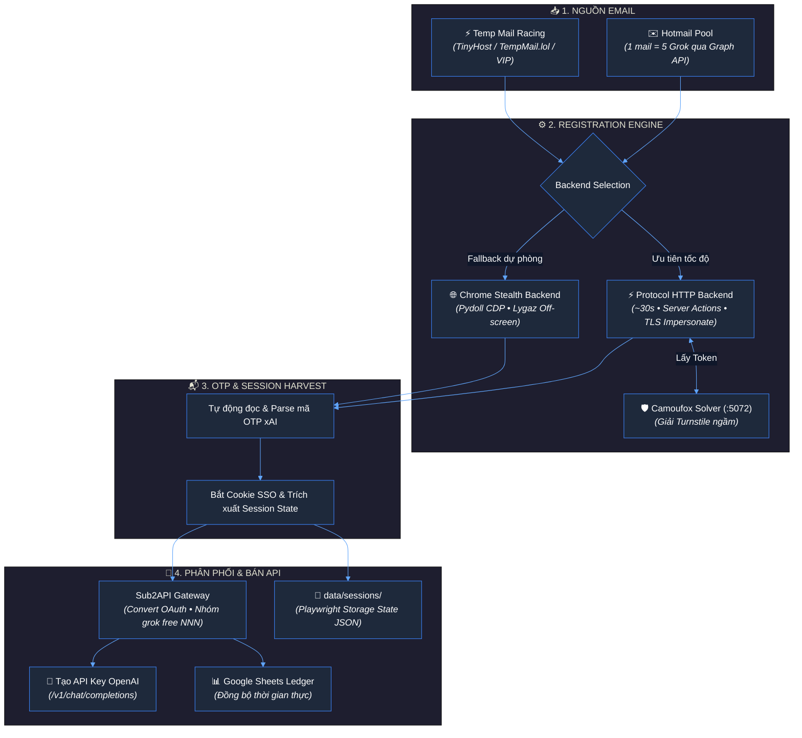
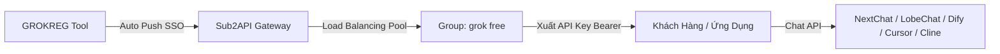

<div align="center">

# ⚡ GROKREG — Enterprise Grok Automation Suite

**Automated xAI / Grok Registration Pipeline · High-Speed Protocol HTTP (~30s) · Sub2API Gateway · Multi-Mail Ecosystem · Google Sheets Sync**

[](https://python.org)
[](https://github.com/vanle1101/grokreg)
[](https://github.com/vanle1101/grokreg)
[](https://github.com/vanle1101/grokreg)
[](LICENSE)

<br/>

<p align="center">
  <a href="#-tổng-quan"><b>🌟 Tổng Quan</b></a> •
  <a href="#-tính-năng-vượt-trội"><b>⚡ Tính Năng</b></a> •
  <a href="#-kiến-trúc--luồng-xử-lý"><b>🔄 Kiến Trúc</b></a> •
  <a href="#-bắt-đầu-nhanh-1-click"><b>🚀 Bắt Đầu Nhanh</b></a> •
  <a href="#-hướng-dẫn-bán-api-qua-sub2api"><b>💼 Bán API (Sub2API)</b></a> •
  <a href="#-bảng-tham-số-cấu-hình"><b>⚙️ Cấu Hình</b></a>
</p>

---

</div>

## 🌟 Tổng quan

**GROKREG** là giải pháp tự động hóa toàn diện dành cho việc đăng ký tài khoản **Grok / xAI** số lượng lớn với hiệu năng công nghiệp. Hệ thống được tối ưu hóa từ gốc để giải quyết bài toán: **Tốc độ cao nhất — Chi phí thấp nhất — Khả năng khai thác & bán API trực tiếp.**

* ⚡ **Tốc độ vượt trội (~30s/acc)**: Không cần mở giao diện Chrome, gửi trực tiếp Next.js Server Actions & gRPC payloads với TLS fingerprint impersonation.
* 🛡️ **Vượt Cloudflare Turnstile ngầm**: Tích hợp Camoufox solver `:5072` xử lý captcha hoàn toàn dưới nền, không cướp chuột, không giật màn hình.
* 💼 **Tích hợp sẵn Sub2API Gateway**: Tự động chuyển đổi Cookie SSO $\rightarrow$ OAuth Token $\rightarrow$ Gom nhóm $\rightarrow$ Xuất API Key tương thích chuẩn OpenAI (`/v1/chat/completions`) để cấp cho khách hàng.
* 📧 **Hệ sinh thái Email kép**: Tiết kiệm 80% chi phí với **Hotmail Plus-Alias** (1 mail = 5 Grok) hoặc dùng **Temp Mail Racing** miễn phí (tự đua lấy inbox nhanh nhất).

---

## ⚡ Tính năng vượt trội

<table width="100%">
<tr>
<td width="50%" valign="top">

### 🚀 Hiệu Năng & Tốc Độ
* **Protocol HTTP Backend**: Đăng ký thuần HTTP qua Server Actions, đạt tốc độ ~25s - 35s/tài khoản.
* **Auto Fallback thông minh**: Tự động chuyển đổi mượt sang Chrome Stealth nếu Protocol gặp rate-limit.
* **Tiết kiệm tài nguyên**: Chạy hàng trăm acc mà không tốn RAM/CPU như các tool mở trình duyệt thông thường.

</td>
<td width="50%" valign="top">

### 🛡️ Giải Captcha & Tàng Hình
* **Camoufox Solver ngầm (`:5072`)**: Microservice giải Turnstile độc lập không hiện cửa sổ.
* **Anti-Flag Engine**: Xóa sạch Webdriver, căn chỉnh múi giờ theo IP, chống vân tay trình duyệt (Canvas/WebGL/Audio).
* **Chế độ Lygaz**: Đẩy cửa sổ trình duyệt ra ngoài tọa độ màn hình khi chạy chế độ browser.

</td>
</tr>
<tr>
<td width="50%" valign="top">

### 📧 Hệ Sinh Thái Email Linh Hoạt
* **Hotmail Plus-Alias (Graph API)**: 1 tài khoản Hotmail tạo được 5 tài khoản Grok (`mail+1@` ... `+4`).
* **Temp Mail Racing**: Đua đồng thời giữa **TinyHost**, **TempMail.lol**, **TempMailVIP** để bắt OTP nhanh nhất, không tốn tiền mua mail.
* **Temp Smart**: Tự động failover giữa `azpopmail` và `tmail.wibucrypto.pro`.

</td>
<td width="50%" valign="top">

### 🔄 Phân Phối & Quản Lý Dữ Liệu
* **Sub2API Auto Import**: Tự động đẩy acc vào Group (`grok free 001`, `002`), test model (`Grok 4.5`).
* **Playwright Storage State**: Lưu toàn bộ session cookies + local storage vào `data/sessions/<email>.json`.
* **Google Sheets Realtime**: Tự động cập nhật bảng tính qua Apps Script / Service Account.

</td>
</tr>
</table>

---

## 📊 So sánh GROKREG với giải pháp truyền thống

| Tiêu chí | Tool Trình Duyệt Truyền Thống | ⚡ GROKREG (Bộ Tool Này) |
| :--- | :---: | :---: |
| **Thời gian tạo 1 tài khoản** | 2 – 4 phút / acc | **~ 25s – 35s / acc** (Nhanh gấp 5 lần) |
| **Tài nguyên tiêu tốn** | Rất nặng (Mỗi luồng ngốn 500MB+ RAM) | **Cực nhẹ** (Chạy nền Protocol HTTP) |
| **Chi phí Email** | 1 Mail mua = 1 Acc Grok | **1 Hotmail = 5 Acc Grok** (Tiết kiệm 80%) |
| **Trải nghiệm màn hình** | Trình duyệt bật tắt liên tục, giật chuột | **Chạy ngầm 100%**, không chiếm màn hình |
| **Bán API cho khách hàng** | Phải lấy cookie và add tay thủ công | **Tự động push vào Sub2API xuất Key ngay** |
| **Khả năng chạy qua đêm** | Dễ crash do lag trình duyệt | **Batch runner có phím dừng ESC khẩn cấp** |

---

## 🔄 Kiến trúc & Luồng xử lý



---

## 🚀 Bắt đầu nhanh (1-Click)

### Bước 1: Tải mã nguồn

```bash
git clone https://github.com/vanle1101/grokreg.git
cd grokreg
```

### Bước 2: Chạy 1-Click duy nhất

Chỉ cần **bấm đúp vào file `start.bat`**:

```text
┌──────────────────────────────────────────────────────────┐
│  ⚡ GROK REGISTER TOOL — Control Center                 │
├──────────────────────────────────────────────────────────┤
│  [1]  🚀 Reg Tài Khoản (Chọn Mail + Số lượng)            │
│  [2]  🌐 Web Control Plane (http://127.0.0.1:8787)       │
│  [3]  🛑 Dừng Khẩn Cấp (Emergency Stop Loop)             │
│  [4]  📌 Tạo Shortcut Ra Màn Hình Desktop                │
│  [0]  🚪 Thoát                                           │
└──────────────────────────────────────────────────────────┘
```

> **Lưu ý**: Lần đầu tiên chạy, `start.bat` sẽ tự động tạo môi trường ảo Python `venv` và cài đặt đầy đủ dependencies một cách tự động.

---

## 💻 Hướng dẫn chạy CLI

Bạn có thể chạy trực tiếp bằng dòng lệnh linh hoạt:

```bash
# 1. Reg 10 acc bằng Temp Mail Racing qua Protocol HTTP (~30s/acc):
venv\Scripts\python.exe main.py 4 --count 10 --backend protocol

# 2. Reg 5 acc bằng Hotmail (1 acc Hotmail = 5 Grok):
venv\Scripts\python.exe main.py 1 --count 5 --backend protocol

# 3. Chạy liên tục không giới hạn (Dừng bất cứ lúc nào bằng phím ESC):
venv\Scripts\python.exe main.py 4 --count 0 --backend protocol
```

### 📋 Bảng mã chọn nguồn Mail (`CHOICE`):

| Mã | Tên Nguồn Email | Mô tả |
| :---: | :--- | :--- |
| **`4`** | **Temp Racing (Khuyên dùng)** | Đua đồng thời TinyHost, TempMail.lol, TempMailVIP để lấy OTP tức thì (Miễn phí 100%) |
| **`1`** | **Hotmail Plus-Alias** | 1 nick Hotmail tạo được 5 acc Grok (`data/hotmails.txt`) |
| **`0`** | **Temp Smart** | Tự động chuyển đổi giữa `azpopmail` và `tmail.wibu` |
| **`5`** | **TinyHost** | Lấy từ hệ thống `tinyhost.shop` |
| **`6`** | **TempMail.lol** | Lấy từ API `tempmail.lol` |

---

## 💼 Hướng dẫn bán API qua Sub2API

Hệ thống được thiết kế hoàn hảo để biến hàng loạt tài khoản Grok thành **Endpoint API chuẩn OpenAI** để bán hoặc phân phối cho người dùng:



### 1. Cấu hình Sub2API trong `grok_tool/config.json`:

```json
{
  "fixed_password": "YOUR_STRONG_PASSWORD",
  "sub2api": {
    "enabled": true,
    "sub2api_url": "http://localhost:8080",
    "sub2api_user": "admin@example.com",
    "sub2api_pass": "admin_password",
    "name_prefix": "grok free",
    "group": "grok free",
    "model_test": "Grok 4.5"
  }
}
```

### 2. Sử dụng API:
Sau khi tool chạy xong, các tài khoản đã được tự động thêm vào Sub2API:
1. Đăng nhập Sub2API (`http://localhost:8080`).
2. Vào mục **Tokens / API Keys** $\rightarrow$ Bấm tạo Token mới (gán vào group `grok free`).
3. Cấp Token này cho khách hàng để gọi API chuẩn OpenAI:

```bash
curl http://localhost:8080/v1/chat/completions \
  -H "Content-Type: application/json" \
  -H "Authorization: Bearer YOUR_SUB2API_KEY" \
  -d '{
    "model": "grok-4",
    "messages": [{"role": "user", "content": "Xin chào Grok!"}]
  }'
```

---

## ⚙️ Bảng tham số cấu hình (`config.json`)

| Nhóm | Tham số | Giá trị mẫu | Giải thích |
| :--- | :--- | :---: | :--- |
| **Bảo mật** | `fixed_password` | `"StrongPass@123"` | Mật khẩu chung đặt cho tài khoản Grok đăng ký mới |
| **Backend** | `reg_backend` | `"protocol"` | Chế độ reg: `"protocol"` (HTTP ~30s), `"browser"` (Chrome ẩn), `"auto"` |
| **Mail Racing**| `tinyhost.base_url` | `"https://tinyhost.shop"` | URL máy chủ TinyHost |
| | `tempmail_vip.api_key` | `""` | API key TempMailVIP (nếu có) |
| **Hotmail** | `hotmail_list` | `"data/hotmails.txt"` | Đường dẫn file danh sách Hotmail |
| | `hotmail_max_aliases` | `5` | Số acc Grok tối đa trên 1 Hotmail (`mail+1`...`+4`) |
| **Solver** | `turnstile.solver_url`| `"http://127.0.0.1:5072"` | Địa chỉ Turnstile Solver Camoufox |
| **Sub2API** | `sub2api.enabled` | `true` | Tự động import tài khoản vào Sub2API |
| | `sub2api.name_prefix` | `"grok free"` | Tiền tố đặt tên tài khoản (`grok free 001`, `002`...) |
| **Lưu Trữ** | `save_storage_state` | `true` | Tự động lưu Playwright Session (`data/sessions/`) |

---

## 🛑 Phím tắt & Cơ chế dừng an toàn

* **`ESC`**: Bấm phím `ESC` ngay trong cửa sổ terminal đang reg để **dừng ngay lập tức** (không mất dữ liệu tài khoản đã reg).
* **`Ctrl + C`**: Ngắt tiến trình terminal.
* **`data/STOP`**: Tạo file `STOP` trong thư mục `data/` để dừng mọi tiến trình chạy ngầm.
* **Stop Button**: Bấm nút Stop trên giao diện Web Control Plane `:8787`.

---

## 📁 Cấu trúc dự án

```text
grokreg/
├── start.bat                   # 🚀 File chạy 1-Click duy nhất
├── README.md                   # 📖 Tài liệu hướng dẫn sử dụng
├── LICENSE                     # 📄 Giấy phép MIT
└── grok_tool/
    ├── main.py                 # 💻 CLI Entry Point
    ├── start.bat               # 🚀 Internal Runner
    ├── config.example.json     # ⚙️ File cấu hình mẫu
    ├── grokreg/                # 📦 Core Package (Clean Architecture)
    │   ├── protocol/           # ⚡ Protocol HTTP Backend (~30s)
    │   ├── browser/            # 🌐 Chrome Stealth Engine (Pydoll)
    │   ├── mail/               # 📬 Hotmail Graph API & Temp Mail Racing
    │   ├── delivery/           # 🔄 Sub2API Client & Storage State Harvester
    │   ├── captcha/            # 🛡️ Turnstile Solver Client
    │   └── tools/              # 🛠️ Interactive UI Menu & Schedulers
    ├── web_console/            # 🌐 Aurora Web Control Plane (:8787)
    ├── services/               # 🛡️ Camoufox Turnstile Solver Service (:5072)
    └── docs/                   # 📚 Tài liệu chi tiết nâng cao
```

---

## 🛡️ License & Tuyên bố miễn trừ

Phần mềm được phát hành theo giấy phép [MIT License](LICENSE). Dự án được xây dựng cho mục đích học tập và nghiên cứu kỹ thuật tự động hóa. Người dùng tự chịu trách nhiệm về việc tuân thủ điều khoản dịch vụ của các nền tảng liên quan.

<div align="center">
  <sub>Được phát triển và duy trì bởi <a href="https://github.com/vanle1101">vanle1101</a></sub>
</div>
