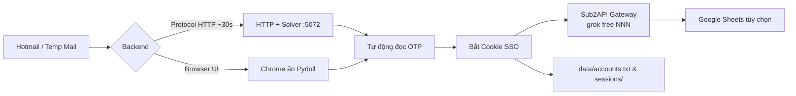

# grokreg

<p align="center">
  <strong>Modular Grok / xAI registration & API delivery pipeline</strong><br/>
  Protocol HTTP · Stealth Browser · Hotmail Alias · Temp Mail Racing · Sub2API · Google Sheets · Web UI
</p>

<p align="center">
  
  
  
  
</p>

Đăng ký tài khoản Grok / xAI tự động theo lô: hỗ trợ đường **Protocol HTTP siêu tốc (~30s)** hoặc **Chrome ẩn**, giải Cloudflare Turnstile ngầm bằng Camoufox solver `:5072`, tự động bắt SSO cookie $\rightarrow$ Convert OAuth $\rightarrow$ Đẩy trực tiếp vào **Sub2API** (tên `grok free NNN`, group `grok free`) để chia tải và xuất API Key OpenAI-compatible bán cho khách hàng.

> **Bảo mật**: Tuyệt đối không commit file `config.json`, file tài khoản `accounts.txt`, `hotmails.txt` hoặc cookie lên GitHub.

---

## ⚡ Tính năng nổi bật

| Tính năng | Chi tiết |
|---|---|
| **Hai phương thức reg** | **Protocol HTTP thuần (~30s)** (nhanh, 0 Chrome, tiết kiệm RAM/CPU) hoặc **Chrome ẩn** (Pydoll CDP) |
| **Hệ thống Mail đa dạng** | **Hotmail Plus-Alias** (1 acc mail tạo được 5 acc Grok qua Graph API) & **Temp Mail Racing** (đua TinyHost / TempMail.lol / TempMailVIP lấy OTP nhanh nhất, miễn phí) |
| **Giải Captcha ngầm** | Turnstile Solver Camoufox `:5072` tự động chạy ngầm, không cướp chuột, không hiện cửa sổ giật màn hình |
| **Phân phối Sub2API** | Tự bắt SSO $\rightarrow$ Convert OAuth $\rightarrow$ `POST /api/v1/admin/grok/sso-to-oauth`, tự đặt tên và gán group bán API |
| **Lưu trữ Session** | Xuất tự động **Playwright Storage State JSON** (`data/sessions/`) phục vụ cho các bot tự động hóa khác |
| **Google Sheets** | Tùy chọn đồng bộ realtime lên Google Sheets qua Apps Script / Service Account |
| **Web Control Plane** | Giao diện điều khiển Aurora UI hiện đại tại `http://127.0.0.1:8787` |
| **Dừng an toàn tức thì** | Bấm phím `ESC` · `Ctrl+C` · file cờ `data/STOP` · nút Stop trên Web UI |

---

## 🔄 Cách hoạt động



1. Lấy mail từ **Hotmail pool** (`data/hotmails.txt`) hoặc **Temp Mail Racing** miễn phí.
2. Đăng ký qua **Protocol HTTP** (mặc định siêu nhanh) hoặc **Browser**.
3. Tự động đọc OTP, hoàn tất đăng ký, trích xuất SSO cookie.
4. Tự import vào **Sub2API** với prefix `grok free` + số tăng dần.
5. Ghi sổ lưu trữ local và xuất session Playwright.

---

## 🚀 Cài đặt & Sử dụng nhanh (1-Click)

### 1. Clone repo

```bash
git clone https://github.com/vanle1101/grokreg.git
cd grokreg
```

### 2. Chạy 1-Click (`start.bat`)

Bấm đúp file **`start.bat`**. Script sẽ tự động:
* Khởi tạo virtualenv Python `.venv` nếu chưa có.
* Cài đặt các thư viện cần thiết (`requirements.txt`).
* Tạo file `config.json` mẫu nếu chưa tồn tại.
* Mở menu tương tác đa năng trên màn hình:

```text
========================================================
  GROK REGISTER TOOL — Menu Chính
========================================================
  [1]  Reg acc          (chọn mail + số lượng)
  [2]  Web UI           (mở web http://127.0.0.1:8787)
  [3]  DỪNG loop        (khi đang chạy liên tục)
  [4]  Tạo shortcut Desktop
  [0]  Thoát
========================================================
```

---

## 💻 Sử dụng CLI

```bash
# 1. Reg bằng Temp Mail Racing qua Protocol HTTP (~30s/acc):
venv\Scripts\python.exe main.py 4 --count 10 --backend protocol

# 2. Reg bằng Hotmail (1 acc Hotmail = 5 Grok):
venv\Scripts\python.exe main.py 1 --count 5 --backend protocol

# 3. Reg liên tục không dừng (đến khi bấm ESC):
venv\Scripts\python.exe main.py 4 --count 0 --backend protocol
```

| Mã số `CHOICE` | Nguồn Email |
|:---:|---|
| `0` | **Temp Smart** (azpopmail ↔ tmail wibu tự đổi khi lag) |
| `1` | **Hotmail** (đọc từ `data/hotmails.txt`) |
| `4` | **Temp Racing** (đua TinyHost / TempMail.lol / TempMailVIP nhanh nhất) |
| `5` | **TinyHost** (`tinyhost.shop`) |
| `6` | **TempMail.lol** |

---

## 🌐 Cấu hình Sub2API để bán API

Mở file `grok_tool/config.json` và điền thông tin Sub2API của bạn:

```json
{
  "fixed_password": "YOUR_STRONG_PASSWORD",
  "sub2api": {
    "enabled": true,
    "sub2api_url": "http://localhost:8080",
    "sub2api_user": "YOUR_ADMIN_EMAIL",
    "sub2api_pass": "YOUR_ADMIN_PASSWORD",
    "name_prefix": "grok free",
    "group": "grok free"
  }
}
```

Sau khi tool reg xong, tài khoản sẽ tự động được gán vào group `grok free` trên Sub2API. Bạn chỉ cần vào Sub2API (`http://localhost:8080`), vào mục **Tokens / API Keys**, tạo API key cấp cho khách hàng dùng với endpoint OpenAI-compatible (`/v1/chat/completions`).

---

## 📁 Cấu trúc thư mục

```text
grokreg/
├── start.bat                 # File chạy 1-click duy nhất
├── README.md                 # Hướng dẫn sử dụng
├── LICENSE                   # Giấy phép MIT
└── grok_tool/
    ├── main.py               # CLI entry point
    ├── start.bat             # Runner trong grok_tool
    ├── config.example.json   # Cấu hình mẫu
    ├── grokreg/              # Core logic package
    │   ├── protocol/         # HTTP protocol backend (~30s)
    │   ├── browser/          # Pydoll Chrome automation
    │   ├── mail/             # Hotmail Graph & Temp Mail Racing
    │   ├── delivery/         # Sub2API client & Storage state
    │   ├── captcha/          # Turnstile client
    │   └── tools/            # UI menu & batch runners
    ├── web_console/          # FastAPI Web UI (:8787)
    ├── services/             # Camoufox Turnstile solver (:5072)
    └── docs/                 # Tài liệu chi tiết
```

---

## 🛡️ License

Phát hành theo giấy phép [MIT](LICENSE).
